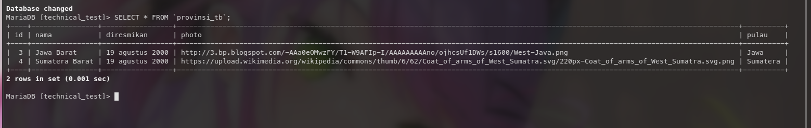
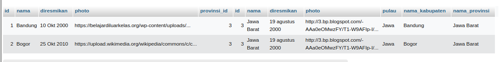
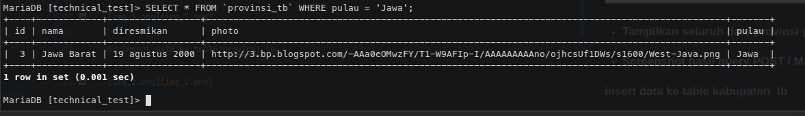
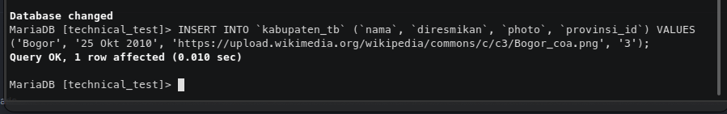
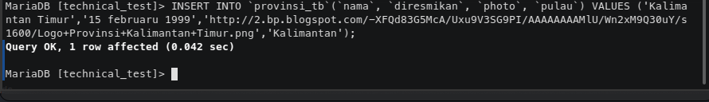

## Jawaban 4.A

- ### Tampikan seluruh data dari table provinsi
``SELECT * FROM `provinsi_tb``

- ### Tampilkan seluruh data *provinsi* beserta *kabupaten*
`SELECT kabupaten_tb.*, provinsi_tb.*, kabupaten_tb.nama as nama_kabupaten, 
provinsi_tb.nama as nama_provinsi FROM kabupaten_tb LEFT JOIN 
provinsi_tb ON kabupaten_tb.provinsi_id = provinsi_tb.id;`

- ### Tampilkan seluruh data provinsi yang berada di pulau tertentu
`SELECT * FROM provinsi_tb WHERE pulau = 'Jawa';`

`

- ### Screenshot hasil query POST / Menambah Data

### insert data ke table kabupaten_tb

### insert data ke table provinsi_tb

